## The Back Story

We have a pretty big legacy monolithic application managed by multiple squads. Each squad is full stack in nature that consists of Developers, QA/SDETs, Product Owners, and EMs to take care of the features end-to-end. Every squad is independent of other squads, and they have different release cadences. 

While managing the Git Workflow of the monolith, we faced some tricky situations where both the classic [Git Flow](https://www.atlassian.com/git/tutorials/comparing-workflows/gitflow-workflow) and the [Trunk-based Development](https://www.atlassian.com/continuous-delivery/continuous-integration/trunk-based-development) approaches fell short. 

The "Distributed Git Flow" is an experiment we wanted to carry out to fix the challenges that we face in our release process. It is a tweaked version of Git Flow to support multiple-independent squads working on a shared large codebase.   

## The Distributed Git Flow Branching Model

Every squad will have two long-living branches

* `staging/{squad-name}` - A master branch for the squad. At any time, this branch should be *Deployment Ready*. Respective PMs/EMs/QAs control what goes into this branch. During the release, the Release team deploy the latest HEAD version of this branch. The will be a dedicated staging environment for each squad that always points to this HEAD version. 

  - Any bugfixes post merging the changes (either from master or develop/{squad-name}) will be raised as a hotfix PR to this branch.

* `develop/{squad-name}` - A develop branch for the squad. All the PRs from the developers will be against this branch. Respective EMs/Leads and QAs control what goes into this branch. QAs will be starting their testing from this branch to sign the corresponding feature/fix/change deployment-ready and they make a call to promote the  changes to the corresponding `staging/{squad-name}`. There will be a dedicated dev environment for each squad that always points to the HEAD version of this branch and the QA will be will testing on this. 

and a short-lived developer owned branch

* `{type_of_change}/{jira_id}` - A developer will be creating a branch following this naming convention and will raise a PR from this branch to `develop/{squad_name}`. Refer to the table below for the type of change. While merging after a successful PR review/checks, these branch changes will be squashed. The developer can create an ephemeral predev environment pointing to this branch. 

| Type of change | Description                                                                                            |
|----------------|--------------------------------------------------------------------------------------------------------|
| feat           | A new feature                                                                                          |
| fix            | A bug fix                                                                                              |
| docs           | Documentation only changes                                                                             |
| style          | Changes that do not affect the meaning of the code (white-space, formatting, missing semi-colons, etc) |
| refactor       | A code change that neither fixes a bug or adds a feature                                               |
| perf           | A code change that improves performance                                                                |
| test           | Add missing tests                                                                                      |
| chore          | Changes to the build process or auxiliary tools and libraries such as documentation generation         |

## How it will work

Let's assume that we have two squads - `mantis` and `viper` (Credits - [Kung Fu Panda](https://en.wikipedia.org/wiki/List_of_Kung_Fu_Panda_characters)). 

When we get started with this approach, the branches would look like below


As part of sprint plan, the `mantis` squad plans to deliver - features `F1` & `F2` and bug fix `B1`. Whereas the the squad `viper` plans to deliver a feature `F3` and the bug fixes `B2` and `B3`. 

### Day 1: Mantis Squad

The developers make the commit `c1`, `c2` and `c3` on the branches `feat/f1`, `feat/f2` and `fix/b1` respectively.


### Day 1: Viper Squad

The developers make the commit `c4`, `c5` and `c6` on the branches `feat/f3`, `fix/b2` and `fix/b3` respectively.


### Day 2: Mantis Squad - Bug Fix B1 is Dev Done

B1's developer raised a PR and it get merged after all the quality checks


### Day 2: Viper Squad - Bug Fixes B2 & B3 are Dev Done

B2 and B3's developer raised two separate PRs and both get merged after all the quality checks


### Day 3 - Viper Squad - Ready to release B2 & B3

Viper Squad's QAs & EMs decided to release the bug fixes `B2` & `B3` alone. So, they raise a PR to their squad's staging branch and got it merged.


### Day 3 - Mantis Squad - Feature F1 is Dev Done

Meanwhile, Mantis Squad's feature F1 is also dev done. F1's dev pulled the latest from their `develop` branch and raised a new PR to `develop`. After all the quality checks, the PR got merged into develop.


### Day 4 - Viper Squad - Bug Fixes B2 & B3 are released to Prod


### Day 4 - Mantis Squad - Got their staging and develop updated with the latest master


Then, the latest staging branch, merged back with the develop branch


Meanwhile, the feature F2 is also dev done and it got merged with the develop branch after syncing with the latest develop branch.


### Day 5 - Mantis Squad - Ready to release F1, F2 & B1

As per the sprint plan, the mantis squad is now completed the features `F1` & `F2` and the bug fixe `B1`. The changes are now raised as a PR to the staging branch and mark it ready for release


### Day 6 - Mantis Squad - F1, F2 & B1 are released to Prod

The release team, now released the mantis squad's change. 


### Day 6 - Viper Squad - Got their staging synced with the latest master


Then, it got merged with the viper squad's develop branch


### Day 7 - Viper Squad - F3 is dev done


### Day 8 - Viper Squad - F3 is ready for release


### Day 9 - Viper Squad - F3 is released to prod


### Day 9 - Mantis Squad - Sync their staging branch with the latest master


### Day N - The Same Flow Repeats...

## Handling Hotfixes

No matter how much vigilant we are, we can't avoid the fact that there will be bugs either after releasing (merging to `master`) or marking it release ready (merging to the `staging/{squad_name}`). 

The fixes to these bugs are considered as hotfixes and it will follow the following pattern.

### Fix to master

A developer takes a new branch `fix/{jira_id}` from the `master` branch and make the commit `c9` to fix the bug identified.


Then he/she will be raising a PR to the `master` branch to get their change verified. Upon successful verification and QA, the PR will get merged and release to prod.


After merging with the `master` branch, A PR will be raised to all the `staging` branches and merged automatically if there is no conflicts. In case of conflicts, the respective squad will be notified. 

Finally, PRs will be raised to all the `develop` branches from the corresponding `staging` branch and merged automatically if there is no conflicts. In case of conflicts, the respective squad will be notified. 


### Fix to staging

It's very similar to fix to `master` except the scope of the change and the PR flow are going to within the squad. 

Let's assume there is a bug in `staging/viper`. A developer, creates a new branch `fix/{jira_id}` from the `staging/viper` and make the commit `c10` to fix that bug.


After successful verification and QA, a PR for the same will be raised from the `fix/{jira_id}` branch to the `staging/{squad_name}` branch and it will get merged


Finally, a PR will be raised to the `develop` branch, (`develop/viper` in this case) and merged automatically if there is no conflicts. In case of conflicts, the respective squad will be notified. 

